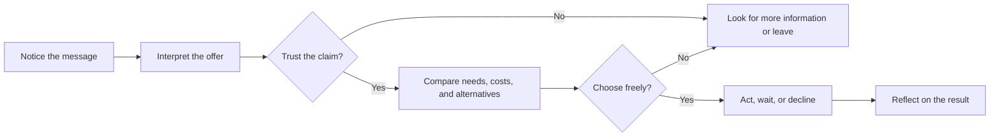

# Chapter 1 — Persuasion and Human Decision-Making

Persuasion is part of ordinary life. A friend recommends a restaurant, a teacher explains why an idea matters, and a product page gives us reasons to choose one item over another. Designers use persuasion whenever they shape what people notice, how they interpret it, whether they trust it, and what they do next.

## What Is Persuasion?

Persuasion is the ethical attempt to influence another person's attention, interpretation, judgment, or action through communication. It can involve words, images, layout, timing, evidence, social context, and emotion. Persuasion does not guarantee that someone will agree; it gives them reasons or a point of view to consider.

Imagine a plain white T-shirt. The shirt itself stays exactly the same, but its presentation can guide attention in different directions:

- A clear list of fabric details and care instructions can persuade through useful information.
- A photograph of friends wearing it can frame it as comfortable and social.
- A simple product page with a repair guarantee can build trust through clarity and reassurance.
- A limited-time claim that is not actually true would create pressure rather than an honest reason to choose it.

The physical product has not changed. The meaning surrounding it has.

## Persuasion Is Not Manipulation

Persuasion and manipulation can both influence decisions, but they differ in how they treat the person making the decision.

| Approach | How it treats the audience | Typical method | Ethical concern |
| --- | --- | --- | --- |
| Persuasion | As a person who can understand, question, and choose | Gives relevant reasons and makes the offer clear | The message should be truthful and proportionate |
| Manipulation | As someone to control or exploit | Hides important facts, uses deception, or targets a vulnerability | The audience cannot make a properly informed choice |
| Coercion | As someone who is not free to refuse | Uses threats, punishment, or overwhelming pressure | Consent and meaningful choice are removed |

A persuasive message can still be strong, emotional, or memorable. The key questions are whether it is honest, whether important information is available, and whether the audience can reasonably say no. Calling an ordinary white T-shirt “the last one available” when more stock is in storage is manipulation, not clever persuasion.

## Cialdini's Principles of Influence

Robert Cialdini's research and writing are widely associated with principles that help explain why some requests and messages feel compelling. These principles describe tendencies, not guarantees. They should be used to make a truthful offer easier to understand, not to bypass a person's judgment.

| Principle | Mechanism | Ethical use | Misuse risk |
| --- | --- | --- | --- |
| Reciprocity | People often feel inclined to return a meaningful favor | Offer a genuinely useful sizing guide or care guide before asking for a purchase | Giving an unwanted token and making the person feel indebted |
| Commitment and consistency | People tend to value decisions that fit their stated values or previous choices | Let customers choose a durable shirt because it matches their stated interest in buying fewer, better items | Pressuring someone with an old statement or small agreement they did not mean as a purchase commitment |
| Social proof | Uncertainty can decrease when people see what others have chosen or approved | Show real, representative reviews and explain how many customers are included | Fabricating reviews, hiding negative information, or implying popularity without evidence |
| Liking | People are more open to messages from people or organizations they like or identify with | Use a relatable model and a respectful, welcoming voice | Using personal similarity or charm to distract from weak quality or missing information |
| Authority | Relevant expertise can make information easier to evaluate | Have a qualified textile professional explain fabric properties, with credentials stated accurately | Borrowing prestige from an irrelevant expert or exaggerating credentials |
| Scarcity | Limited availability can make an opportunity seem more valuable or urgent | State a real production limit or actual remaining stock clearly | Inventing a deadline, countdown, or shortage to rush a decision |
| Unity | A shared identity or sense of belonging can build trust | Invite people into a community around repair, local production, or another real shared purpose | Pretending to share an identity in order to exploit group loyalty |

These principles often work together. For example, a T-shirt made in a genuinely limited batch might use scarcity, while transparent customer reviews use social proof. Combining principles does not make an untrue claim true. More influence increases the responsibility to be accurate.

## Other Useful Ideas

### Framing
Framing means selecting and organizing details so that people see a situation from a particular angle. A white T-shirt can be framed as a low-cost basic, a blank canvas for self-expression, a carefully made long-lasting garment, or a uniform for a community. Each frame highlights some information and leaves other information in the background.

Framing is unavoidable; every message has a point of view. Ethical framing does not require saying everything at once, but it does require not hiding facts that would reasonably change the decision. If a shirt is marketed as “built to last,” the design should make its material, construction, and care expectations easy to check.

### Choice Architecture
Choice architecture is the way options are arranged and presented. Order, labels, defaults, filters, and the number of choices can all affect what people select. A clothing page might place a recommended white T-shirt first, provide an easy size chart, and make “continue browsing” as visible as “buy now.”

Good choice architecture reduces confusion and supports the person's goal. Bad choice architecture makes an unwanted option the default, hides the cancellation path, or uses confusing buttons. A useful test is whether the same arrangement would still seem fair if the audience understood exactly how it worked.

### Ethos, Pathos, and Logos
Rhetoric traditionally describes three ways a message can build influence:

- **Ethos** is credibility: why should the audience trust the speaker or organization?
- **Pathos** is emotional appeal: what feelings or values does the message activate?
- **Logos** is reasoning: what evidence or explanation supports the claim?

A responsible T-shirt message can use all three: an accurate account of how the shirt is made (ethos), a photograph that suggests ease and comfort (pathos), and clear information about price, fabric, and care (logos). Emotion is not automatically deceptive, and facts are not automatically persuasive. Strong communication usually connects the three.

## A Simple Decision Journey

A person's decision is not a perfectly linear calculation. Still, this simplified journey helps designers notice where a message may influence someone:

At each stage, design can help or interfere. Clear hierarchy helps attention. Specific language helps interpretation. Evidence supports trust. Visible alternatives protect choice. Follow-up information helps people learn whether the decision worked for them.

## Ethical Cautions for Designers

Persuasion becomes especially risky when the audience has less information, less time, less money, or less power than the communicator. Extra care is needed with children, people in crisis, and people making health, financial, or safety decisions.

Before publishing a message, check the facts behind every claim. Separate a real limitation from artificial urgency. Make important costs and conditions visible. Avoid exploiting shame, fear, loneliness, or confusion. Also ask whether the design remains fair when viewed by someone who does not share the target audience's identity or prior knowledge.

## Questions to Ask Before Trying to Persuade

1. What decision am I asking someone to make?
2. What does the audience need to know to make that decision well?
3. Which claims can I verify, and which are only impressions or opinions?
4. Am I making the choice clearer, or making refusal harder?
5. Who benefits from this message, and who might bear the risk?
6. Would I consider this fair if the roles were reversed?
7. Does the white T-shirt actually deliver what this framing promises?

## Explore Further

For outside research, search for:

- Robert Cialdini's principles of influence and later discussions of the unity principle
- ethical persuasion versus manipulation in design and communication
- framing effects in psychology and behavioral economics
- choice architecture and informed consent
- ethos, pathos, and logos in rhetorical analysis

## What You Should Remember

Persuasion shapes attention, meaning, trust, and action, but it should preserve informed choice. Cialdini's principles, framing, choice architecture, and rhetoric help explain why messages influence people. The same plain white T-shirt can acquire different meanings through presentation, yet ethical design still depends on truthful claims, visible tradeoffs, and room to say no.
