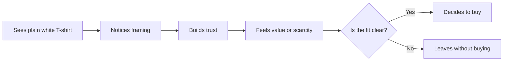

# Persuasion and Human Decision-Making

Persuasion is not magic. It is the process of helping people notice something, understand it in a certain way, trust it, and decide whether to act. In design and branding, persuasion shapes attention, interpretation, and action. It can help someone see a product as useful, trustworthy, meaningful, or worth the price. It can also be used badly.

A useful way to think about persuasion is this: it is not simply about making someone say yes. It is about helping a person make a better decision with enough information, context, and clarity to choose freely.

## What Persuasion Is

Persuasion is a form of communication that aims to influence how someone thinks or acts without relying on force. It often works by changing what people notice, how they interpret what they see, and which reasons feel strongest.

For example, the same plain white T-shirt can be presented in different ways:

- as a basic, affordable staple
- as a premium, limited-edition garment
- as a minimalist statement of taste
- as a cultural symbol or community item

The shirt itself does not change. What changes is the frame. Persuasion helps people interpret that shirt differently: as practical, luxurious, expressive, or meaningful.

That is why persuasion matters in design, advertising, packaging, product strategy, and everyday communication. It helps people connect a product or message to a need, a desire, a value, or a story they already care about.

## Persuasion Is Not the Same as Manipulation

Persuasion becomes manipulation when it hides information, exploits fear, pressures people into choices they do not understand, or uses emotional tricks to bypass real judgment.

A persuasive message is usually transparent and respectful. It gives people reasons, context, and a chance to decide. A manipulative message often relies on confusion, deception, urgency without value, or pressure that does not allow genuine choice.

Think of the difference this way:

- persuasion says: “Here is the value, here is the context, here are the trade-offs.”
- manipulation says: “Do not think too much; act now, or you will miss out.”

Persuasion respects agency. Manipulation tries to bypass it.

This distinction matters because persuasion is not automatically unethical. In fact, ethical persuasion is often the goal of good communication: giving people relevant information and helping them make informed choices. Problems arise when communication tries to hide the real cost, distort the truth, or trigger action through guilt, panic, or exploitation.

## Robert Cialdini's Principles of Influence

Robert Cialdini identified several recurring patterns in how people decide. These are classic tools of persuasion, but they are most useful when used honestly and thoughtfully.

### 1. Reciprocity

People feel obliged to return favors or kindness. If someone gives us something, we often feel pressure to give back in some way.

Example: a brand gives a free sample, then a customer feels more inclined to buy.

Ethical use: offer value genuinely. Misuse risk: creating guilt or a sense of debt that pressures someone to buy something they do not want.

### 2. Commitment and Consistency

People like their choices to align with what they have already said or done. Once a person commits to a position, they tend to act consistently with it.

Example: a person who says they care about sustainability is more likely to buy a product that appears aligned with that value.

Ethical use: connect your message to values people already hold. Misuse risk: pushing people into public commitments they later regret.

### 3. Social Proof

People look to others when they are unsure. If many people are doing something, it can feel safer or more correct.

Example: reviews, crowd sizes, testimonials, or “best-selling” labels can influence a decision.

Ethical use: show genuine evidence and real customer experience. Misuse risk: fake reviews, inflated claims, or social pressure that hides poor quality.

### 4. Authority

People tend to trust expertise and status. We often defer to people or institutions that seem knowledgeable.

Example: a product recommended by a credentialed expert may feel more credible than the same product recommended by a stranger.

Ethical use: demonstrate real expertise and clear evidence. Misuse risk: pretending to be an expert or using authority to override independent thinking.

### 5. Liking

People are more likely to respond well to people they like, find familiar, or see as similar to themselves.

Example: a brand with warm, human, relatable tone may feel easier to trust than a cold, impersonal one.

Ethical use: build trust through honesty and clarity. Misuse risk: manipulating emotion so people ignore actual product quality.

### 6. Scarcity

People often value things more when they seem limited, rare, or time-sensitive.

Example: “Only a few left” or “limited run” can increase urgency.

Ethical use: describe real limitations honestly. Misuse risk: fabricating scarcity or creating fake urgency to pressure a sale.

## Other Useful Ideas from Psychology, Behavioral Economics, and Communication

Cialdini gives us a strong foundation, but persuasion is broader than a single list of tricks. Several other ideas are especially useful.

### Framing

Framing is about how information is presented. The same fact can feel very different depending on the language used.

A plain white T-shirt can be framed as:

- “Everyday essential”
- “Luxury cotton”
- “Designed to be worn forever”
- “A blank canvas for self-expression”

The meaning shifts because the frame shifts. That is why framing is one of the most important tools in communication. It helps people interpret a message before they even evaluate it.

### Loss Aversion

People tend to feel the pain of a loss more strongly than the pleasure of an equivalent gain. A product feels more valuable when the message highlights what the buyer might lose by not acting.

Example: “This sale ends tonight” or “You may miss the opportunity to own a piece that sells out quickly.” This is not always unethical, but it becomes problematic when the pressure is exaggerated or the loss is not real.

### The Role of Clarity and Cognitive Load

People decide more easily when the message is simple and easy to process. If too many choices, too much jargon, or too much competing information appear at once, decision-making becomes harder.

In practice, good persuasion often means reducing confusion, not adding more pressure. Clear language, strong hierarchy, and a visible call to action often work better than loud claims or overloaded messaging.

## A Simple Decision Journey

This diagram is simple, but it captures the heart of persuasion: a consumer notices the product, interprets it through a frame, evaluates trust and value, and then chooses.

## Questions to Ask Before Trying to Persuade

Before trying to persuade someone, a designer or communicator should ask:

- What am I really trying to help the person decide?
- Am I giving accurate information, or am I hiding important trade-offs?
- Who is the audience, and what do they already value?
- Am I creating clarity, or am I creating confusion?
- Am I asking for action because it is genuinely helpful, or because I want a quick result?
- What is the ethical cost of my message if it works too well?
- Would I still be comfortable if the person had more time, more information, and no pressure?

Good persuasion should improve understanding and support choice. If the answer to those questions is shaky, the message probably needs revision.

## A White T-Shirt Example

A plain white T-shirt is a useful example because it is familiar, inexpensive, and easy to misunderstand. It has limited physical difference from one brand to another, so meaning becomes the main variable.

Here is the same shirt described in different ways:

- Basic utility frame: “A clean, durable everyday shirt for comfort and simplicity.”
- Premium frame: “An heirloom-quality cotton tee made in small batches and designed to last.”
- Minimalist frame: “A blank canvas for personal style; less noise, more intention.”
- Cultural or identity frame: “A statement of quiet confidence, designed for people who prefer substance over excess.”

The product is the same. The persuasion changes because the frame changes. One message may speak to everyday practicality, another to status, another to expression, and another to values.

This is the central lesson: people do not just buy objects. They buy meaning, identity, reassurance, convenience, and social fit.

## A Practical Table

| Principle | Mechanism | Ethical use | Misuse risk |
|---|---|---|---|
| Reciprocity | People return favors and value | Give useful samples, helpful information, or genuine value | Creates pressure or guilt to pay back in a way that ignores real need |
| Commitment and consistency | People prefer choices that fit earlier decisions | Connect products to existing values and identity | Pushes people into commitments they have not fully considered |
| Social proof | People trust what others do | Show honest reviews and real evidence | Fake popularity or inflated claims |
| Authority | People trust expertise | Use clear expertise and transparent credentials | Pretend authority or overwhelm with status instead of evidence |
| Liking | People respond to familiar, relatable signals | Build authentic tone and human trust | Use charm or emotional appeal to distract from weakness |
| Scarcity | People value what seems limited | State real supply limits clearly | Invent urgency or fake exclusivity |
| Framing | Meaning shifts with how information is presented | Explain value in clear, truthful language | Distort the product by emphasizing only the strongest narrative |
| Loss aversion | People resist loss more than they seek gain | Encourage action by highlighting real trade-offs and deadlines | Use fear, pressure, or fake deadlines to panic a decision |

## Ethical Cautions

Persuasion becomes most powerful when it is honest. It should not rely on exploiting people's insecurities, making false urgency, hiding important information, or reducing them to passive targets. The strongest persuasion does not strip away agency; it helps people recognize value and decide thoughtfully.

A good designer asks not only, “How can I make this more appealing?” but also, “How can I make this more honest, clearer, and more respectful of the person deciding?”

## Explore Further

If you want to deepen your understanding, search for:

- Robert Cialdini influence principles
- framing in communication and design
- loss aversion and behavioral economics
- social proof and decision-making
- ethical persuasion versus manipulation

## What You Should Remember

Persuasion is the art of guiding attention, interpretation, trust, and action without force. It is not the same as manipulation, because it does not remove a person's ability to choose freely. Cialdini's principles give us a useful language for understanding influence, but ethical persuasion depends on clarity, honesty, and respect.

The same plain white T-shirt can be sold as a basic staple, a luxury item, a minimalist statement, or a symbol of identity. That is not because the shirt changes; it is because the message changes. And in design, that is often the real difference between an object people ignore and an object people care about.
