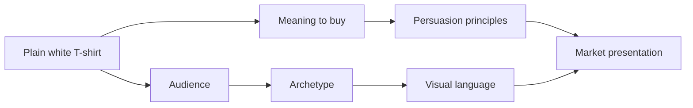

# The Plain White T-Shirt Case Study

A plain white T-shirt is one of the best products for studying persuasion, archetype, and design language because it is simple, familiar, and easy to misunderstand. It is not a luxury object, but it can be sold as a symbol of freedom, discipline, identity, taste, rebellion, or belonging. The product itself is mostly the same. The meaning changes because the brand, message, and visual language around it change.

This is the heart of the case study: the same shirt can be positioned as different products for different customers.

## The Core Product

The core product is a high-quality plain white T-shirt made from comfortable cotton, designed to be durable, easy to wear, and versatile. It is an ordinary object with a surprisingly wide range of emotional and cultural meanings.

What makes the shirt interesting is not its raw material or construction alone. It is the story around it: what kind of person the shirt helps the wearer become.

## Concept 1: The Explorer T-Shirt

### Audience

Students, travelers, remote workers, and people who want a life that feels open and active.

### Brand archetype

Explorer

### Persuasion principles

- Social proof through “outdoor, everyday, and on-the-go” imagery
- Scarcity through limited seasonal release
- Framing that links the shirt to freedom and movement
- Identity-based messaging: “The shirt belongs to people who move freely.”

### Visual-design language

A lightly modern, travel-inspired system with warm neutrals, textured photography, and open negative space. The layout feels practical but aspirational.

### Headline

“Built for the road, the studio, and the unplanned day.”

### Short product story

This version presents the shirt as a daily companion for people who live with curiosity. It is designed to feel useful, flexible, and ready for movement. The message says: your life is not static, and your clothing should not be either.

### Likely imagery

Dusty roads, train stations, city walks, open skies, backpacks, worn notebooks, and natural light. The shirt appears as a reliable piece that disappears into real life rather than dominating it.

### What the customer is being invited to buy

Not just a shirt, but a version of themselves as mobile, adaptable, and unafraid of the unexpected.

### Ethical concern or limitation

This approach can drift into romanticizing a restless lifestyle or implying that owning the product makes someone more adventurous than they are.

## Concept 2: The Swiss Modernist T-Shirt

### Audience

Design students, minimalist shoppers, disciplined professionals, and people who prefer function with restraint.

### Brand archetype

Sage or Ruler

### Persuasion principles

- Authority through clarity and quality claims
- Commitment and consistency through “less is more” values
- Framing that makes simplicity feel premium
- Scarcity through small-batch production or limited color runs

### Visual-design language

Swiss / international typographic style: grid, strong hierarchy, careful spacing, neutral palette, no unnecessary decoration, and precise typography.

### Headline

“Essential form. Thoughtful function.”

### Short product story

This shirt is positioned as a deliberate object. It is not trying to shout. It is designed to express order, quality, and confidence through restraint. The product feels premium because it refuses excess.

### Likely imagery

Minimal studio shots, soft shadows, strong negative space, close-ups of fabric texture, and a neutral palette of white, charcoal, and gray. The visuals emphasize construction, proportion, and finish rather than lifestyle fantasy.

### What the customer is being invited to buy

Not just comfort, but a sense of intentional living, taste, and control. The customer buys clarity and credibility.

### Ethical concern or limitation

The risk here is that the shirt may feel too polished or emotionally empty. Minimalism can be used to create a fake sense of depth or make a basic product feel more expensive than it really is.

## Concept 3: The Rebel T-Shirt

### Audience

Young adults, artists, students, culture-makers, and anyone who values anti-mainstream identity.

### Brand archetype

Rebel

### Persuasion principles

- Scarcity through limited drops
- Social proof through community identity
- Liking through edgy, culturally aware tone
- Framing that makes the shirt a statement against blandness

### Visual-design language

Disruptive postmodern design: asymmetry, collage, stacked type, loud contrast, rebellious graphics, and misaligned compositions.

### Headline

“Wear the silence. Break the pattern.”

### Short product story

This version rejects the idea that the T-shirt is a neutral background. It becomes a signal of resistance, edge, and self-definition. It is shaped for people who want to look and feel distinct without needing to shout too loudly.

### Likely imagery

Bold editorial layouts, gritty textures, distorted type, layered photographs, and deliberately awkward composition. Colors might be stark black, acid red, fluorescent accents, or off-beat combinations.

### What the customer is being invited to buy

Not simply clothing, but a feeling of independence, cultural attitude, and social distinctiveness.

### Ethical concern or limitation

It can become performative or exclusionary. A rebellious brand can accidentally turn taste into a status marker and make people feel they must break with the mainstream to be authentic.

## Concept 4: The Creator T-Shirt

### Audience

Artists, designers, students, freelancers, makers, and people who see themselves as creators rather than consumers.

### Brand archetype

Creator

### Persuasion principles

- Reciprocity through free creative tools or community value
- Framing that treats the shirt as a canvas for identity
- Commitment and consistency through self-expression narratives
- Liking through a human, approachable tone

### Visual-design language

A hybrid of modern clarity and creative experimentation. The layout feels open, but it allows handmade marks, textured overlays, and personal expression.

### Headline

“A blank shirt for a bold idea.”

### Short product story

This version treats the shirt as a starting point rather than a finished identity. It is not simply “designer gear.” It is a platform for experimentation, art, and self-invention. The wearer is invited to make the product their own.

### Likely imagery

Sketches, acrylic marks, process shots, painted surfaces, fabric close-ups, and collages that suggest the shirt is part of a creative practice rather than a status purchase.

### What the customer is being invited to buy

Not just a shirt, but permission to create, experiment, and build a visible personal identity through everyday objects.

### Ethical concern or limitation

This can become a clever story that hides weak product quality. The shirt must actually be good or the whole “creative identity” pitch can feel empty.

## Concept 5: The Caregiver or Everyday Essential

### Audience

Busy professionals, young families, practical shoppers, and people who want reliability and comfort.

### Brand archetype

Caregiver or Everyperson

### Persuasion principles

- Trust through straightforward product claims
- Social proof through real-life use and testimonials
- Clarity and simplicity
- Reassurance rather than spectacle

### Visual-design language

Warm, steady, plain, and familiar. This presentation avoids excess and focuses on comfort, durability, and daily usefulness.

### Headline

“Made for the rhythm of real life.”

### Short product story

This shirt is positioned as dependable, honest, and easy to integrate into everyday routines. It is not about performance branding or aesthetic revolution. It is about being useful and consistent.

### Likely imagery

Neutral home interiors, coffee cups, morning routines, casual office settings, friends laughing, and honest, natural light. The shirt appears integrated into normal life rather than staged as an icon.

### What the customer is being invited to buy

An experience of ease, trust, and everyday competence rather than aspiration or status.

### Ethical concern or limitation

This approach can be too generic or intentionally dull, making the product feel like a blank utility item rather than something memorable.

## Synthesis Table

| Concept | Audience | Archetype | Persuasion tools | Visual language | Core meaning sold |
|---|---|---|---|---|---|
| Explorer | Active, curious people | Explorer | Scarcity, identity, framing | Warm, travel-inspired modernity | Freedom and adaptability |
| Swiss Modernist | Minimalist, design-aware people | Sage / Ruler | Authority, clarity, consistency | Swiss / International style | Discipline, taste, intentionality |
| Rebel | Culture-driven, anti-mainstream people | Rebel | Scarcity, social proof, edge | Disruptive postmodern | Rebellion and distinction |
| Creator | Artists, makers, students | Creator | Framing, community, self-expression | Hybrid modern + expressive | Originality and personal creation |
| Everyday Essential | Practical, busy consumers | Caregiver / Everyperson | Trust, clarity, simplicity | Calm, familiar, grounded | Reliability and ease |

## How Product + Audience + Meaning + Persuasion + Visual Language Combine

This diagram shows that a product does not sell on its own. It becomes a market presentation only when audience needs, cultural meaning, persuasive cues, and visual design work together. The shirt stays the same while the brand story changes the customer experience.

## Why This Matters

This case study shows that design and persuasion are not separate layers. They are part of the same decision process. People do not only ask, “Is this shirt comfortable or good quality?” They also ask, “What does this shirt say about me? What kind of life does it belong to? What kind of person would wear it?”

That is why the same product can be sold in so many ways. It is not the shirt that changes. It is the narrative built around it.

## What You Should Remember

The same plain white T-shirt can be framed as a tool for freedom, a sign of taste, a statement of rebellion, or a platform for creativity. The shirt is a fixed object, but the market presentation is not. Persuasion, archetype, and design language all work together to define the product's meaning in the customer's mind.

A strong product presentation does not simply describe what the item is. It tells the audience what they can feel, become, or belong to by choosing it. That is the real power of branding and design.
