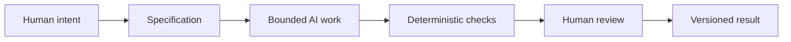

# Synthesis: Persuasion, Archetypes, and Design Language in AI-Assisted Work

The previous chapters each looked at one lens: persuasion, archetypes, and design language. Taken separately, they explain how people choose, how brands create meaning, and how visual systems shape interpretation. Taken together, they form a practical framework for directing creative and technical work, including work with AI.

This is not just a theory chapter. It is a working model for how to make decisions under uncertainty.

## One Framework, Three Questions

A useful way to organize the earlier chapters is to ask three questions before beginning any project:

- Persuasion: What response are we trying to enable?
- Archetype: What meaning or identity are we expressing?
- Design language: How should that meaning look and feel?

These questions help make creative work more intentional. They also help direct AI outputs.

If a task is vague, the AI may produce something that is general, generic, or aesthetically plausible but weak in purpose. If the task is bounded with clear intent, the AI has a better chance of producing something useful and aligned with the goal.

## The Three Lenses Working Together

### Persuasion helps us define the desired action

Persuasion is about attention, trust, interpretation, and action. It asks: what should the audience notice, what should they believe, and what should they do next?

In a design or communication task, this means identifying the response you want to encourage. Do you want someone to understand a concept? Trust a product? Buy something? Feel a certain identity? Share information? It is important to define this clearly before generating work.

### Archetype helps us define the emotional meaning

An archetype gives a project or product a recognizable kind of meaning. It helps answer: what story is being told, and what identity is being invited?

A brand may want to feel like an Explorer, a Sage, a Rebel, a Creator, or a Caregiver. A project may want to feel warm, disciplined, rebellious, thoughtful, or grounded. Without that clarity, work can become generic or inconsistent.

### Design language helps us define the visual system

Design language is the outward expression of that meaning. It answers: how should this communicate through shape, tone, hierarchy, typography, color, and arrangement?

The same message can look trustworthy and restrained, playful and disruptive, or luxurious and carefully controlled depending on the visual system. Design language shapes the meaning before a person even reads the text.

## Why This Matters for AI-Assisted Work

AI is powerful, but it is not a substitute for judgment. It is a tool for producing drafts, patterns, and options. The outputs are often plausible, fast, and useful, but they also may be vague, inconsistent, or overconfident. That is why a structured approach matters.

When we use the three lenses as a control framework, we create an intentional brief. Instead of asking an AI to “make this look good,” we can ask:

- What action are we trying to support?
- What identity or meaning is the work expressing?
- What visual language is appropriate for that goal?

This turns creative work into a designed system rather than a vague request.

## Specification, Deterministic Checks, and Human Judgment

A good AI task should be bounded by a specification.

### Why a specification matters

A specification is a clear statement of what the work must do, what constraints it must respect, and how success will be judged. It reduces ambiguity and helps the AI operate within a known problem space.

Without a specification, an AI system is left to guess the objectives. It may generate something elegant but not aligned. It may miss missing requirements, invent facts, or overfit to the wrong tone. A strong specification narrows the space of acceptable outputs and makes review more efficient.

### Why version control matters

Version control matters because AI-generated work is often iterative. It may evolve across drafts, prompts, and revisions. Git gives traceability: you can see what changed, when it changed, and who or what created each version.

This is especially important when AI is part of the workflow. If a paragraph becomes inaccurate, a style drifts away from the brief, or a generated file introduces a problem, version control gives a recovery path. It also allows a team to compare versions and judge if the latest output is actually better.

### Why deterministic checks are useful

Deterministic automated checks are useful because they are cheap, repeatable, and objective. They verify that the work meets a standard without relying on human interpretation alone.

Examples include:

- checking that required files exist
- verifying headings and structure
- checking links or formatting conventions
- testing for broken syntax
- confirming that expected sections are present

These checks are helpful because they do not require emotional interpretation. They give fast feedback and reduce the chance that a mistake slips through because a person is tired or rushed.

### Why AI review is useful but probabilistic

AI can help review work quickly. It can look for missing sections, vague language, inconsistent tone, or patterns of error. This is valuable because it can scan across large amounts of text and identify likely problems.

But AI review is probabilistic. It may suggest improvements that sound reasonable but are not necessarily correct. It can also overlook subtle mistakes, especially when the task requires context or moral judgment. AI is good at pattern recognition and drafting, but it is not a final authority on meaning, truth, or value.

### The pit-stop metaphor

Think of human review like a race-car pit stop. The car keeps moving, and the crew keeps working in the background. But at selected moments, especially when the stakes are high, it is worth stopping and checking the tires, the fuel, the engine, and the route.

In the same way, automation can keep running through routine checks while humans intervene at crucial points: when the brief is ambiguous, when the work carries meaning, when the content touches ethics, or when a decision has real consequences.

Automation is useful for speed. Human review is useful for judgment.

## The Complete Workflow

This workflow matters because it balances speed with responsibility. The AI can assist in producing drafts, but the specification creates direction, checks create confidence, and human review provides the final judgment.

## Why Human Judgment Remains Central

AI systems can generate material quickly, but human beings remain responsible for:

- intent
- context
- meaning
- truthfulness
- appropriateness
- ethical risk
- final decisions

A good AI workflow does not remove human responsibility. It distributes work more effectively. The AI drafts. The process checks. The person interprets. The version control preserves the trail. The final decision remains human.

This is the real lesson of the guide: persuasion, archetype, and design language are not just ways to sell things. They are tools for clarifying intention, shaping meaning, and guiding decision-making. The same logic applies when using AI to generate work. If the task is well framed, well bounded, and reviewed critically, the output is far more likely to be useful and trustworthy.

## Questions for Next Week

- What does a strong specification look like in a real project?
- When should a team rely on automation, and when should a person intervene?
- How do archetype and visual language affect AI-generated imagery and writing?
- What kinds of decisions should never be left entirely to a model?
- How can version control make AI-assisted work more honest and more recoverable?

## What You Should Remember

Persuasion answers the question of response. Archetype answers the question of meaning. Design language answers the question of expression. Together, they create a practical framework for shaping communication and creative work.

When applied to AI-assisted production, this framework helps us move from vague prompts to disciplined work: define intent, specify constraints, allow the model to assist within bounds, run automated checks, and reserve deliberate human review for moments that matter. Version control preserves the trail. Deterministic checks make work more reliable. Human judgment keeps the work meaningful and honest.

That is the real synthesis: good design is not only about how something looks. It is about how clearly intention, meaning, and responsibility are built into the work.
